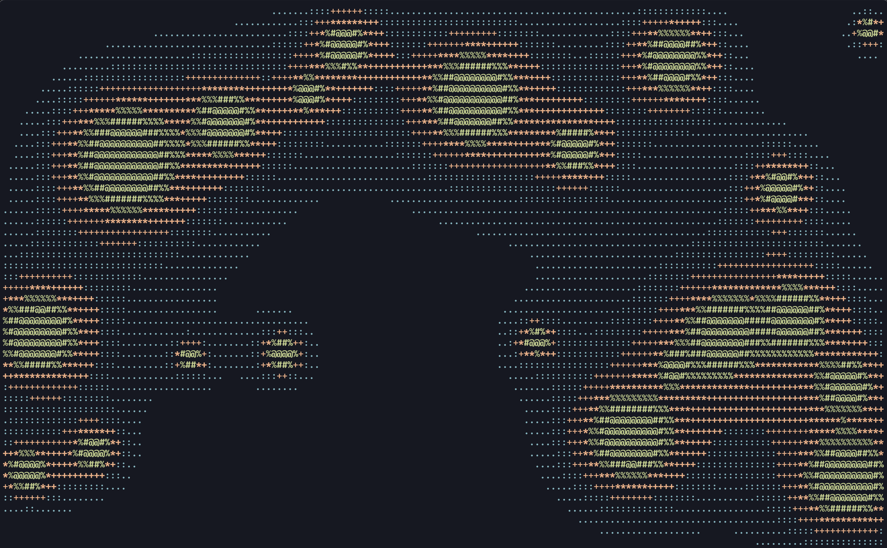

# lavalamp

A mesmerizing lava lamp ASCII art animation for your terminal, written in Rust.



## Features

- Metaball-based rendering — blobs merge and separate organically
- Realistic thermal physics — blobs heat at the bottom, rise, cool at the top, and sink
- Auto-cycling terminal colors with smooth palette transitions
- Adjustable blob count at runtime

## Install

```sh
cargo install --path .
```

Or just build and run:

```sh
cargo run --release
```

## Controls

| Key | Action |
|-----|--------|
| `c` | Change color randomly |
| `+` / `=` | Add a blob (max 100) |
| `-` / `_` | Remove a blob (min 1) |
| `r` | Reset blobs |
| `q` / `Esc` / `Ctrl+C` | Quit |

Colors also auto-change every 60 seconds.

## Requirements

- A terminal with 16-color ANSI support (basically any modern terminal)
- Rust 1.70+
